# Near-Field probes

_A simple design of H-Field and E-Field probes._

## Description

| 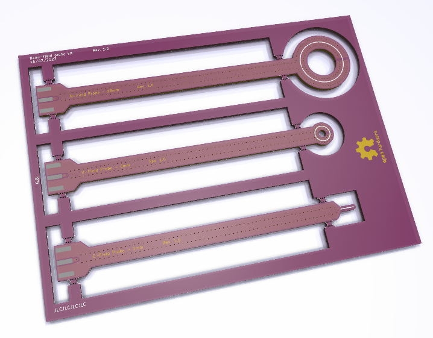 | 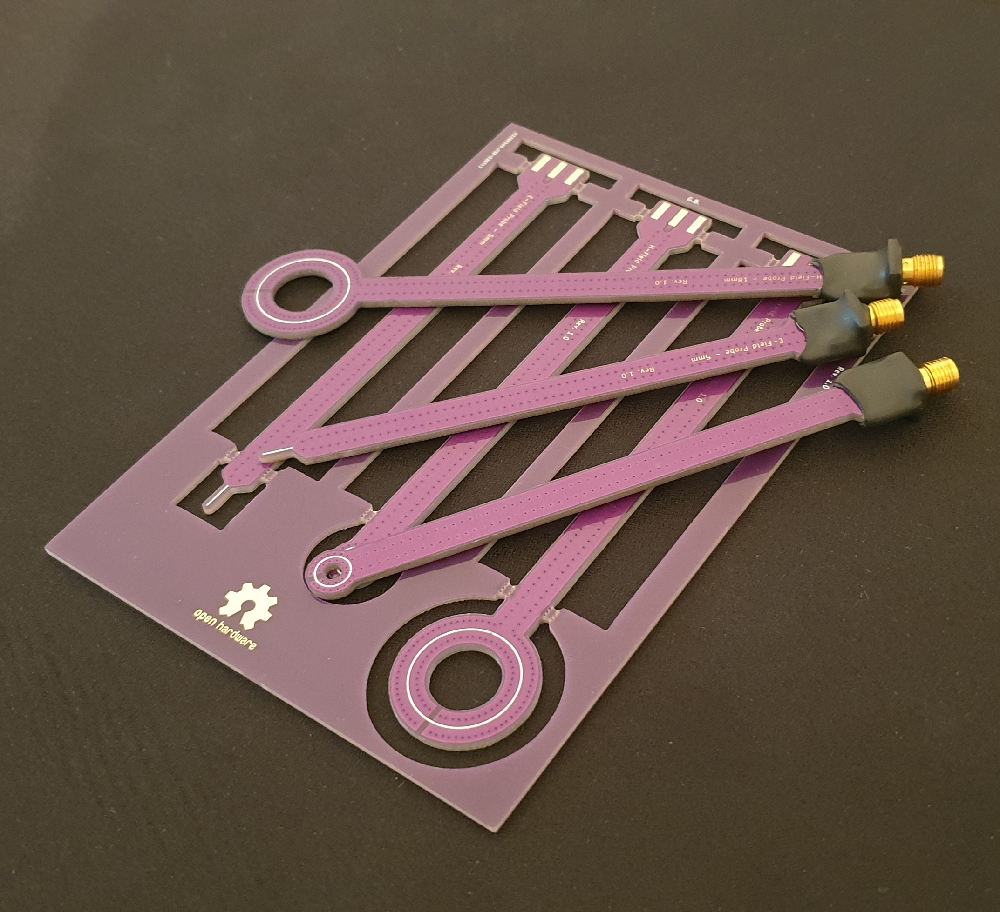 |
|:--:|:--:|
| 3D view | Real probes |

For now, three probes were designed :
* An 18 mm H-Field circular probe
* A 6 mm H-Field circular probe
* A 5 mm E-Field probe

All probes handles have the same length ($\approx 100 mm$). An SMA connector is used to connect the probe to the spectrum analyzer.

# Design

### Design tools

These probes were designed using [KiCad](https://www.kicad.org/). The integrated calculator was used to compute RF transmission lines characteristics.

For the ease of manufacturing purposes, all probes are panelized. But each probe has its own PCB CAD file.

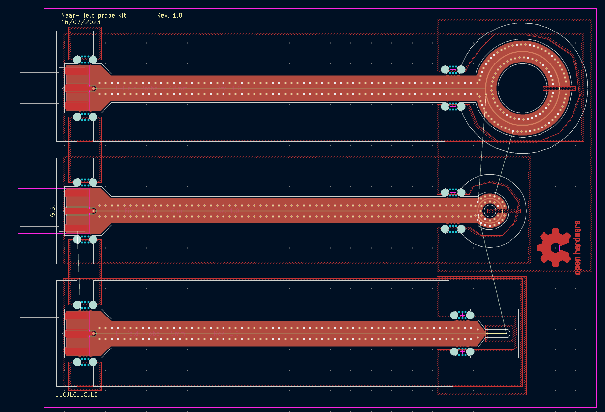

### Design choices
Designed to be made with [JLCPCB](https://jlcpcb.com/)'s **JLC7628** 4-layer stackup.

The impedance-controlled transmission line is modeled as a stripline.
Since the dielectric is asymmetric (the prepreg is thinner than the core), a linear approximation of the dielectric constant was made relative to the thickness of the two layers (although it probably is a bad approximation).

Choosen $\epsilon_r$ : $4.548$

The stripline is routed on the first inner layer, while the other ones are copper-filled. The final track width is approximately  $0.29mm$.

For H-Field probes, a slit is made in the ground planes at the extremity of the loop. A center hole is made to reduce dielectric loss.

Via-fencing is used to reduce unwanted electro-magnetic coupling to the stripline.

## Characterization

### Coupling

Coupling (and thus frequency response) was measured with a *VNA*. Two probes of the same type are placed back-to-back axially and spaced by $10mm$, and each one is connected to a port of the VNA. Since two identical probes are used, the $S21$ parameter can be divided by two to give the frequency response of a single probe at a distance of $10mm$ from the source.

To make sure H-Field probes have a good immunity against the E-Field, each pair were placed at a $90°$ angle : a great reduction of the coupling should be observed (H field canceled, and low sensitivity to E field).

| | S21 - Parallel | S21 - 90° |
|:--:|:--:|:--:|
| 18 mm H-Field probe | 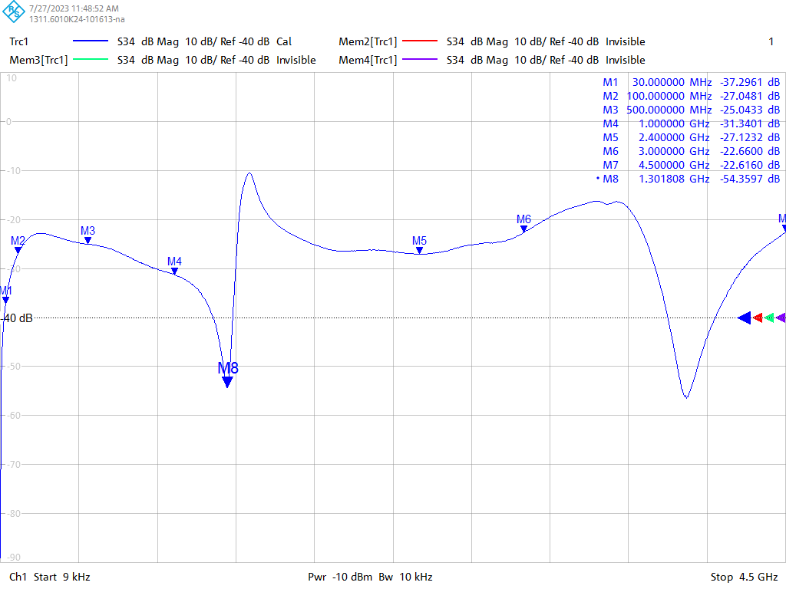 | 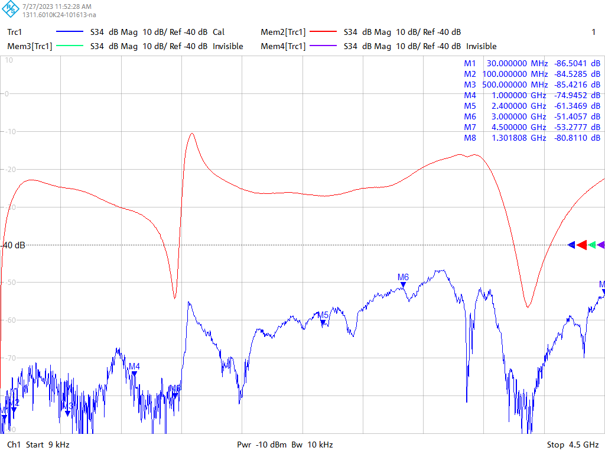 |
| 6 mm H-Field probe | 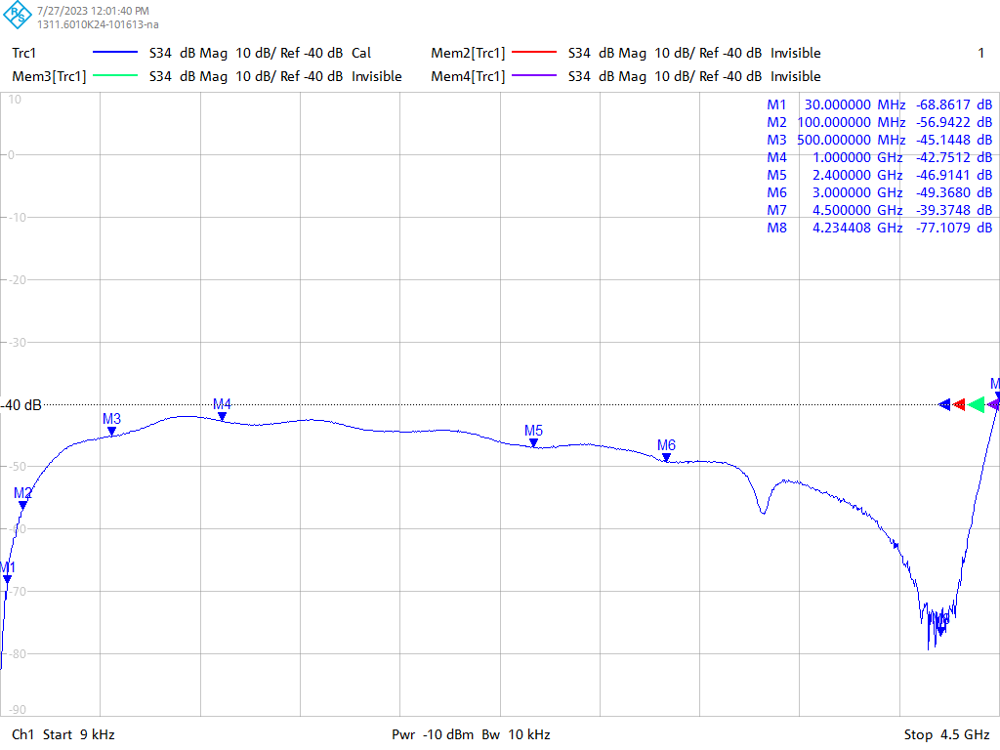 | 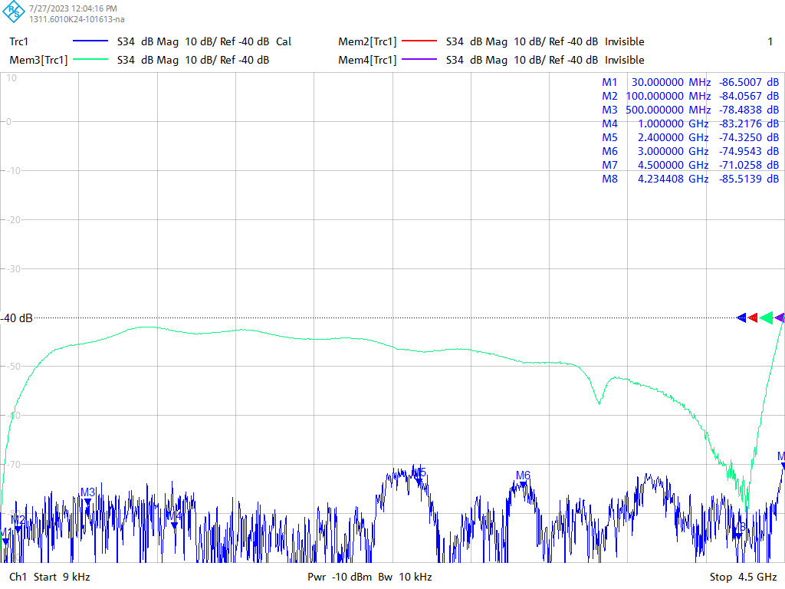 |
| 5 mm E-Field probe | 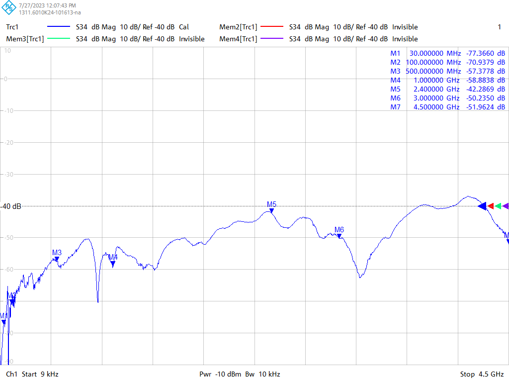 | 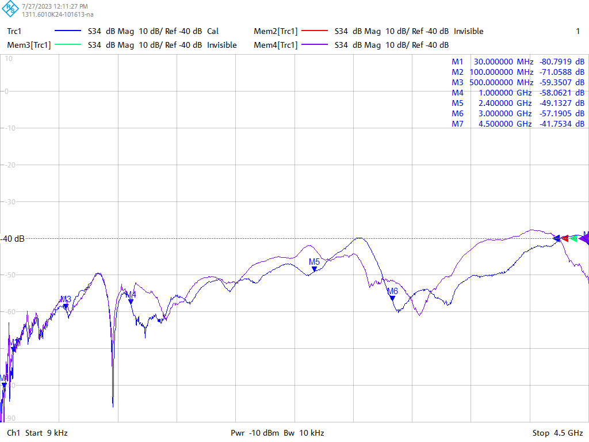 |

- Note 1 : The measured $S21$ is *not* divided by 2 in the VNA captures. It corresponds to the raw $S21$ measurement between two identical probes.
- Note 2 : For the E-Field probe, the coupling is almost identical regarding the orientation - but this probe is certainly not H-Field coupled. The E-Field is much less dependant on the orientation than the H-Field. For the H-Field probes, the coupling is greatly reduced when placed at a $90°$ angle.

For H-Field probes, the resonant frequency is directly linked to the loop diameter $D$ (so the wavelengh $\lambda$) :

$f_{res}={c_0\over\lambda\sqrt{\epsilon_r}} \rightarrow f_{res}={c_0\over 2\pi D \sqrt{\epsilon_r}}$

The measured resonant frequencies are quite close to the theory :

| | 18 mm H-Field | 6 mm H-Field |
|:--:|:--:|:--:|
| $f_{res_{th}}$ | $1.24 GHz$ | $3.73 GHz$ |
| $f_{res_{meas}}$ | $1.30 GHz$ | $4.23 GHz$ |
| *Equivalent electrical diameter* | $17.2mm$ | $5.29 mm$ |

There is a strong $S21$ dip at the resonant frequency, so the probes are less usable around $f_{res}$.

### Matching

All the probes are not well matched : the $S11$ is always close to $0dB$. But this is expected since H-Field probes are basically short-circuits and E-Field probes are open-circuits. The broadband operation of the probes prevents a good impedance matching.

Even with poor matching, we previously saw that the coupling is quite good.

| | S11 |
|:--:|:--:|
| 18 mm H-field probe | 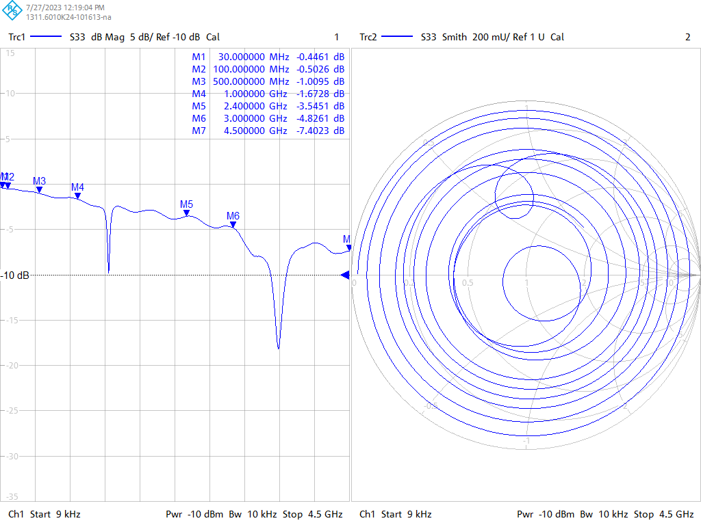 |
| 6 mm H-field probe | 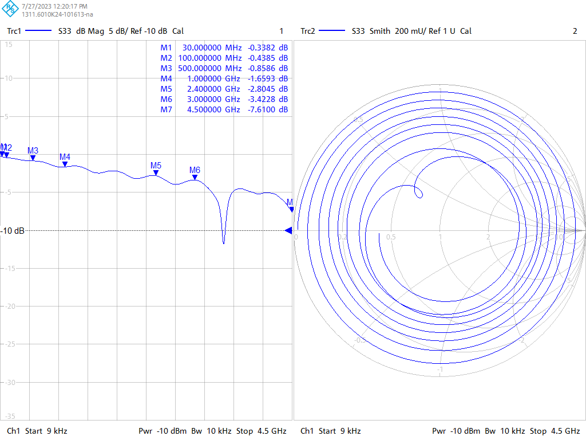 |
| 5 mm E-field probe | 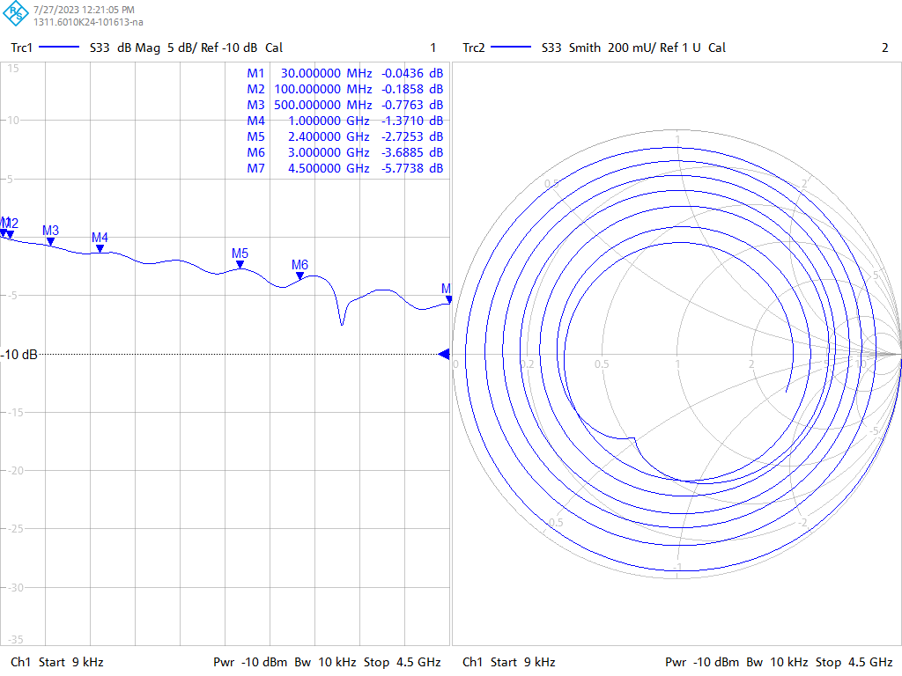 |
