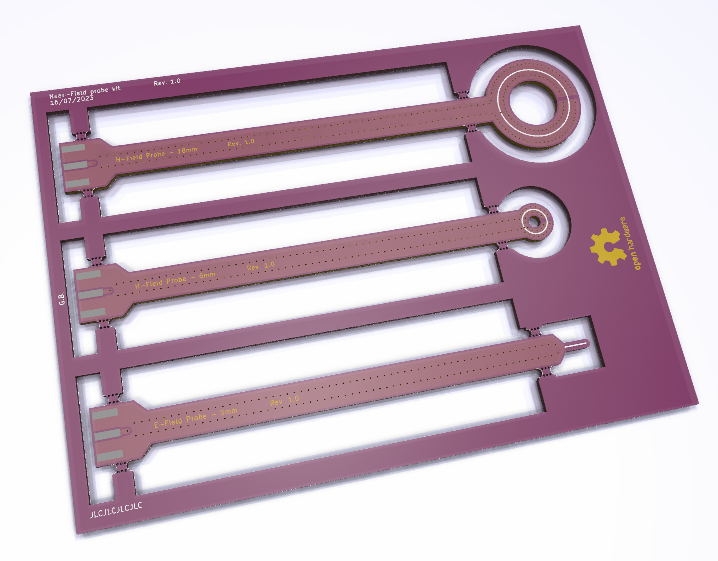
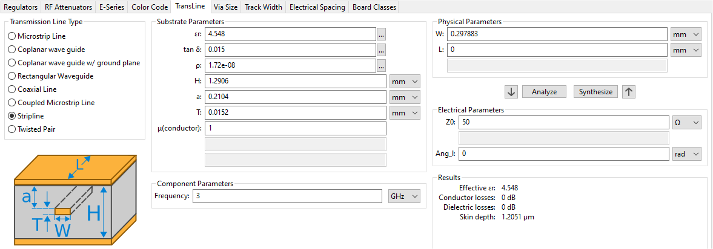

# Near-Field probe

_A simple design of H-Field and E-Field probes._

## Description

For now, there is three probes :
* An 18 mm H-Field circular probe
* A 6 mm H-Field circular probe
* A 5 mm E-Field probe

# Design
Designed to be made with JLCPCB's JLC7628 4-layer stackup.

The impedance-controlled transmission line is modeled as a stripline.
The dielectric is asymmetric (the prepreg is thinner than the core), so a linear approximation was made in function of the thickness.

